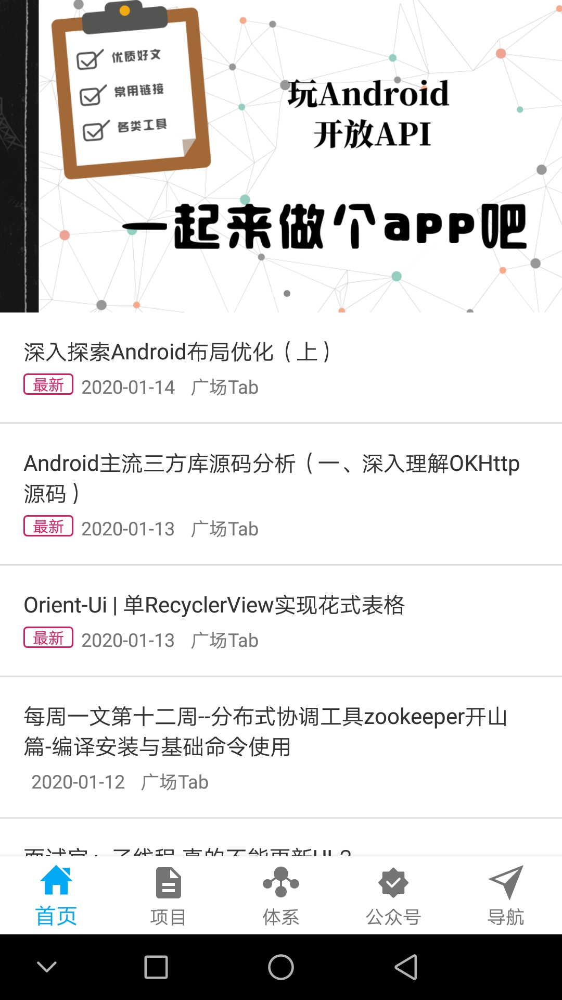
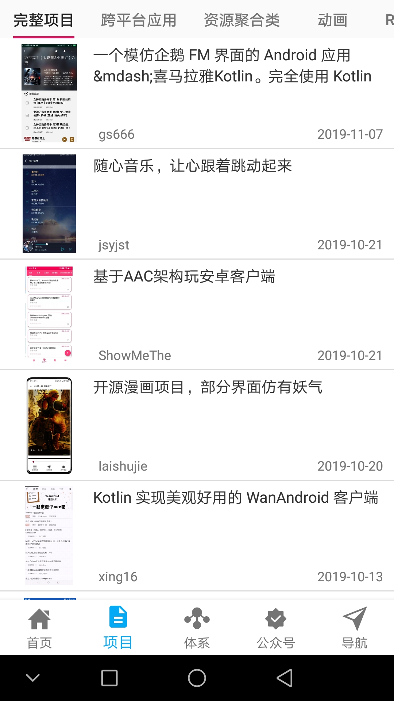
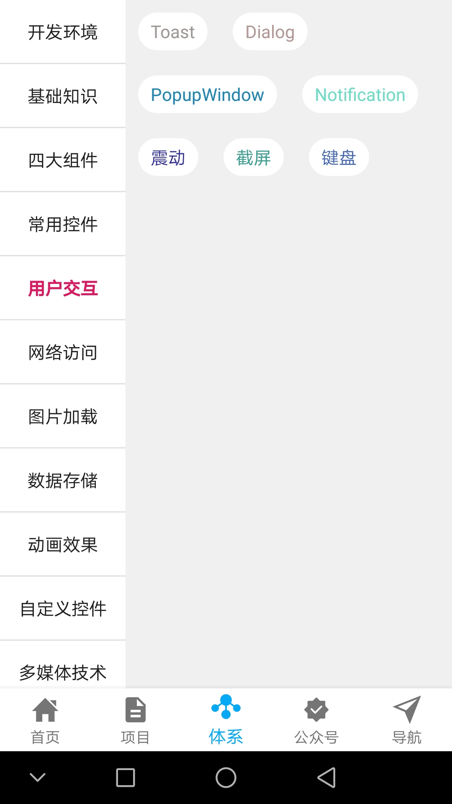
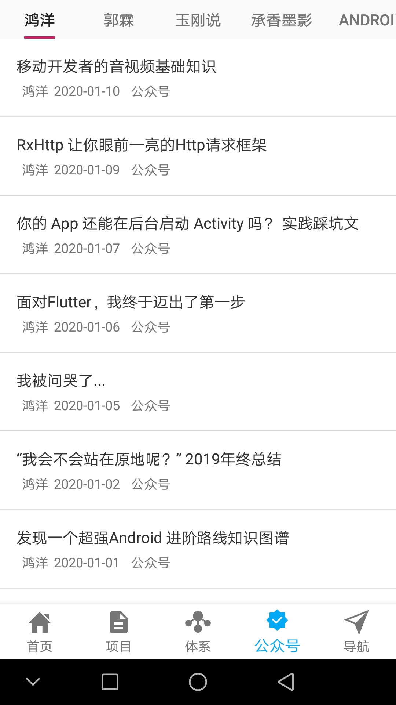
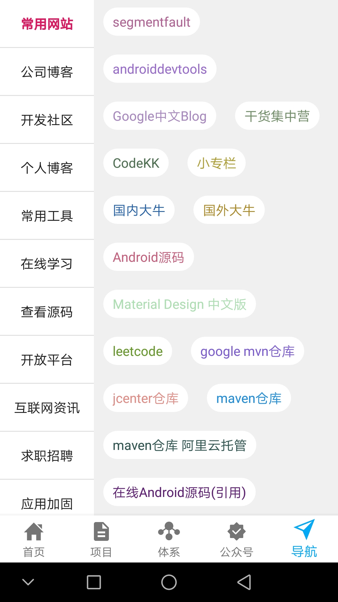

# kotlin-wanAndroid

## 简介
kotlin-wanAndroid是一款使用kotlin语言，结合dagger2、Livedata、ViewModel、retorfit2、Navigation等开发的一款玩android客户端。

## API
[玩android开放API](http://blog.csdn.net/guodongxiaren)

## 项目截图
|  |  |  |
| --- | --- | --- |
|  |  |  |

## APK下载
[APK](https://raw.githubusercontent.com/kevin-lemon/kotlin-wanAndroid/master/app/release/app-release.apk)
